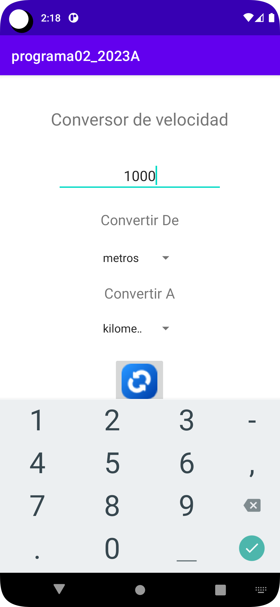
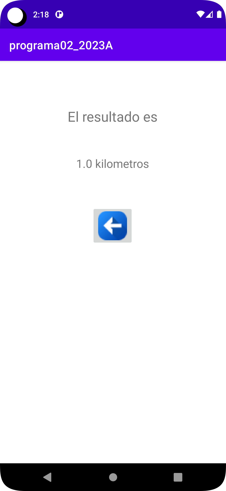

# programa02_2023A

Conversor de velocidades 

* metros 
* kilometros
* millas
* nudos

# Interfaz

# Proposito del proyecto

Este proyecto es meramente de ejemplo fue realizado para la materia de Sistemas basados en conocimiento,   
